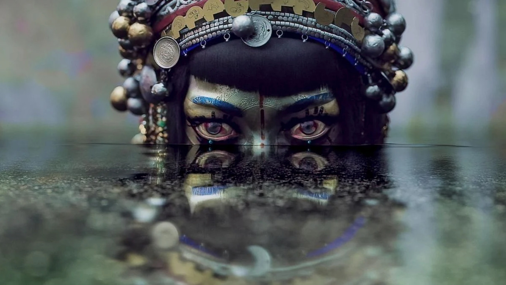

# Pixel Sorting (Python)

A Python reimplementation of the classic pixel sorting glitch art effect.  
Based on the Unity compute-shader project [Pixel-Sorting](https://github.com/GarrettGunnell/Pixel-Sorting), but implemented in plain Python with OpenCV, NumPy, and [colour-science](https://pypi.org/project/colour-science/).

---

## Features
- Pixel sorting by **luminance** or **HSL (hue, saturation, lightness)**.
- Horizontal or vertical spans.
- Adjustable thresholds (`--low`, `--high`) to mask which pixels are sorted.
- Optional random offsets and invert masks.
- Sort by RGB or HSL channels.
- Reverse order sorting.
- Gamma correction.
- Simple CLI interface.

---

## Installation
Clone the repository and install requirements:

```
git clone https://github.com/ffathy-tdx/pixel-sorting-python.git
cd pixel-sorting-python
pip install -r requirements.txt
```


## Usage
```
python pixel_sort.py input.jpg output.jpg --show
```

## Options
```
--low 0.2           # low threshold (default 0.2)  
--high 0.8          # high threshold (default 0.8)  
--channel hsl_l     # channel for masking: luminance, hsl_h, hsl_s, hsl_l  
--invert            # invert the mask  
--random_offset 0.05 # random noise in mask thresholds  
--vertical          # sort vertically instead of horizontally  
--metric hsl_l      # sorting metric: luminance, r, g, b, hsl_h, hsl_s, hsl_l  
--reverse           # reverse sorting order  
--gamma 1.2         # gamma correction (default 1.2)  
--show              # preview with matplotlib
```

## Examples
<div align="center">

<table>
<tr>
<td><b><center>Original</center></b></td>
<td><b><center>Pixel Sorted</center></b></td>
</tr>

<tr>
<td></td>
<td></td>
</tr>

<tr>
<td></td>
<td></td>
</tr>

<tr>
<td></td>
<td></td>
</tr>
<tr>
<td></td>
<td></td>
</tr>

</table>

</div>

## Original Idea & Unity Implementation
[Acerola on Youtube](https://www.youtube.com/watch?v=HMmmBDRy-jE)  
[GitHub Repository](https://github.com/GarrettGunnell/Pixel-Sorting)
